# 2025年排名前15的AI视频翻译配音工具盘点(最新整理)

全球化内容创作已成为品牌和创作者的核心需求,传统人工配音耗时长、成本高且难以规模化。AI视频翻译配音工具通过自动化语音识别、神经网络翻译和语音合成技术,让创作者能够在数分钟内将单一语言视频转化为130+种语言版本,成本降低10倍以上,制作速度提升70%。本文精选15个经过验证的平台,涵盖教育、营销、影视和社交媒体等多种场景,帮助您快速找到适配跨境传播、多语种课程和品牌本地化的最佳方案。

## **[Rask AI](https://www.rask.ai)**

一站式视频本地化平台,专为需要快速多语言部署的企业和创作者设计。

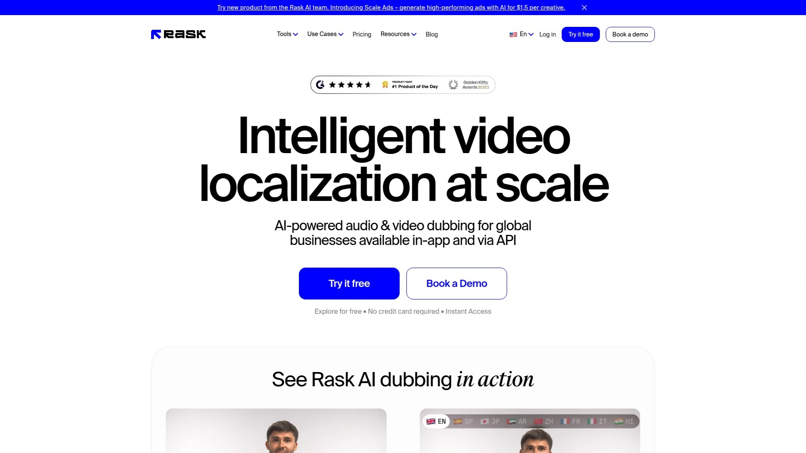

Rask AI支持130+种语言的自动翻译与配音,核心优势在于其VoiceClone技术能够在29种语言中克隆原始说话者的声音特征,保持品牌一致性。平台集成了自动字幕生成、SRT文件上传、多说话人检测和唇形同步功能,无需在多个编辑工具间切换。

适用于EdTech在线课程本地化、YouTube频道国际化扩展以及企业培训视频的快速翻译。其AI驱动的语音识别准确度高,能够自动移除填充词并生成自然流畅的配音效果。对于长视频内容,Rask提供稳定的处理能力和API集成选项,方便批量处理。平台拥有55万+活跃用户社区,每分钟翻译成本低至1美元,比传统方法节省时间达70%。

## **[Synthesia](https://www.synthesia.io)**

企业级AI视频创作平台,将文本转化为140+语言的专业视频内容。

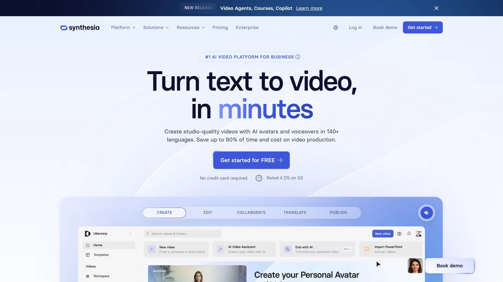

Synthesia不仅提供视频翻译,还能创建自定义AI数字人,实现真人级别的表达和手势同步。平台支持150+AI虚拟形象,可根据品牌风格定制logo、配色和模板,确保每个视频保持统一的品牌调性。其一键更新功能允许修改源视频后自动同步所有语言版本,避免重复制作。

特别适合企业培训视频、销售赋能内容和客户服务知识库的大规模制作。内置AI脚本助手可自动生成演示文稿内容,配合65+视频模板和自动字幕功能,即使没有视频编辑经验也能快速产出专业作品。实时团队协作功能支持多人同时审阅和评论,统一的多语言播放器可在单一界面切换140+语言版本。平台提供SCORM格式导出,与学习管理系统无缝集成。

## **[HeyGen](https://www.heygen.com)**

面向创作者和企业的全方位视频翻译工具,以精准唇形同步闻名。

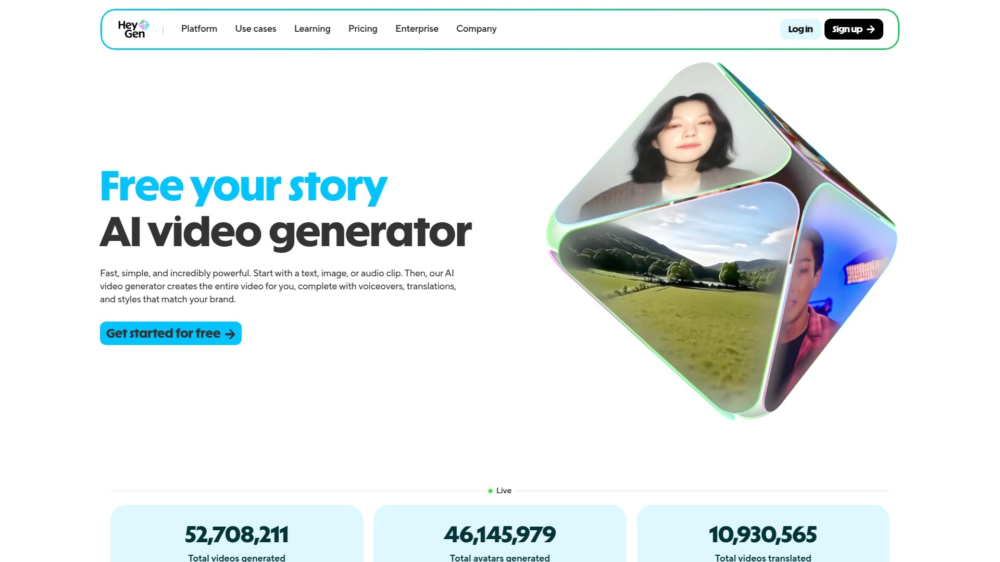

HeyGen支持175+语言和方言的视频本地化,核心技术在于其AI语音克隆和唇形同步算法,能让翻译后的视频看起来像母语者在自然说话。只需上传视频文件或粘贴YouTube链接,一键即可生成多语言配音版本,无需昂贵的重拍或人工配音。平台提供动态时长调整功能,自动优化片段长度以提升翻译质量和音频自然度。

YouTuber可使用其快速创建本地化频道,扩大国际订阅者基数并提升SEO排名。企业用户能够保留原视频规格和高清画质,选择品牌专属语音文件。多说话人自动检测功能可为视频中不同人物分配独特语音,字幕嵌入选项增强可访问性。HeyGen还提供AI虚拟人创建服务,适合制作讲解视频和产品演示。

## **[Murf AI](https://murf.ai)**

专注音频配音的AI平台,提供30+语言的超逼真语音克隆服务。

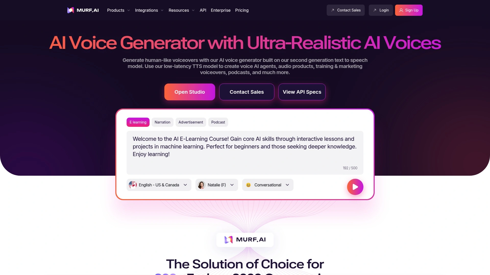

Murf AI拥有200+种AI配音声音库,覆盖不同音调、口音和情感风格,支持120+AI配音声音用于多语言本地化。其即时语音克隆技术无需复杂训练即可复制原始说话者声音,保持跨语言的音色一致性。用户可精细调整音调、语速、重音和停顿,实现品牌完美的本地化效果。

配音生产时间减少80%,支持一次性处理多个文件和多种语言。平台提供完美的唇形同步功能,确保视觉体验的真实性。内容可直接分发到YouTube、TikTok、Vimeo等平台,成本比传统配音显著降低。Murf通过SOC 2、GDPR合规和ISO认证,提供企业级安全保障。适用于培训视频、教育内容、营销广告和企业宣传片的快速多语言制作。

## **[ElevenLabs Dubbing](https://elevenlabs.io/dubbing-studio)**

高保真语音克隆与配音平台,以超真实语音合成技术著称。

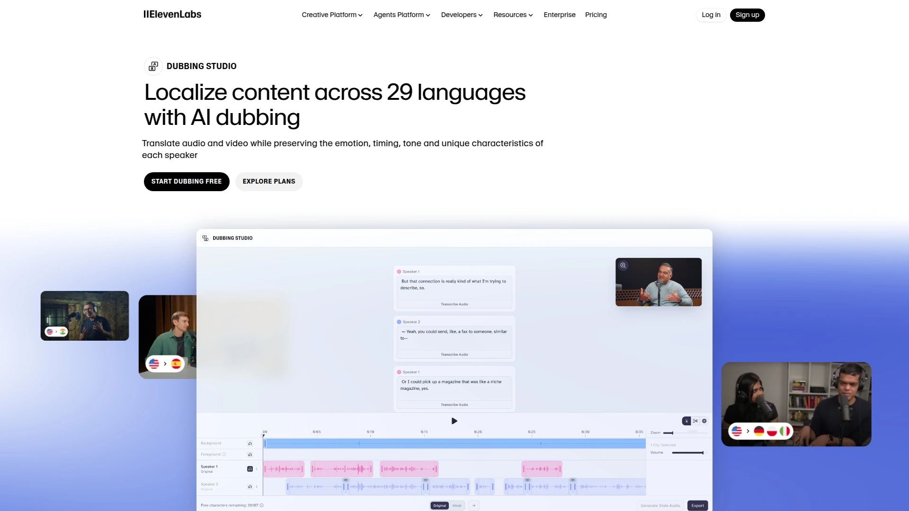

ElevenLabs使用深度学习技术在数分钟内完成音频和视频文件的翻译与配音,节省大量时间和成本。其神经网络模型能够生成超逼真的语音,精细控制韵律和情感表达,确保配音的自然度和感染力。平台适合需要高品质音频输出的专业项目,如有声读物、播客和广告配音。

语音克隆功能只需极短的音频样本即可创建个性化语音模型,保持说话者的独特音色特征。工作流程简洁高效,上传文件后选择目标语言即可自动生成配音成品。适合内容创作者、播客主和品牌营销团队使用,能够快速扩展内容的国际影响力。

## **[Descript](https://www.descript.com)**

文本化视频编辑平台,集成翻译、配音和Overdub语音克隆功能。

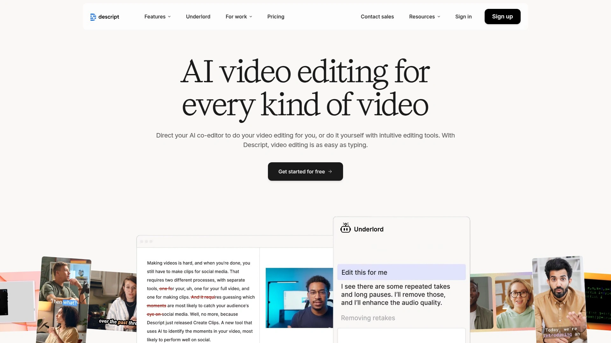

Descript独特之处在于其基于文本的编辑方式,修改文字即可自动更新配音,无需处理复杂的音频波形和时间轴。平台支持20+语言的视频翻译和AI配音,内置Underlord AI助手可自动处理翻译和配音任务。用户可选择Descript内置声音库或克隆自己的声音用于多语言翻译。

特别适合播客创作者和视频制作者,其Overdub功能能够复制用户声音并进行多语言翻译,效果极为逼真。一键背景噪音消除工具可清理嘈杂环境录音,去除嗡嗡声、回声和杂音。实时团队协作功能支持共享文件、评论和进度跟踪。云端工作流确保项目自动保存,不受设备限制。字幕和翻译可同时生成,提升视频可访问性。

## **[Wavel AI](https://wavel.ai)**

全能型视频创作平台,整合配音、字幕和虚拟人功能。

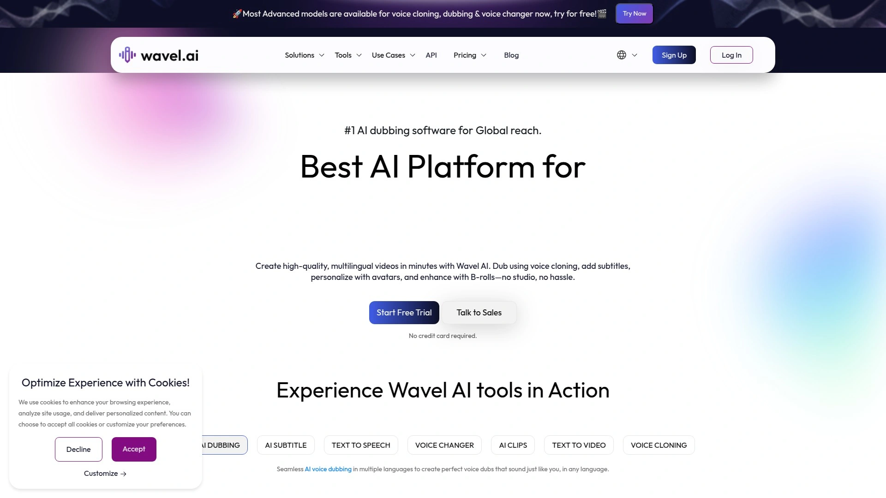

Wavel AI支持100+语言的视频翻译,提供精准的唇形同步和多说话人检测能力。平台使用先进AI技术确保翻译的准确性和自然度,字幕和配音可一键自动生成。语音克隆功能保留原始说话者的语调和说话风格,适合品牌内容的全球化传播。

创作者可利用Wavel制作本地化YouTube频道、教育课程和营销视频,打破语言障碍。平台提供B-roll增强和虚拟人定制服务,丰富视频表现形式。转录、文本转语音和字幕工具一应俱全,是多语言内容创作的综合解决方案。工作流程简化,上传视频、选择语言、挑选AI声音后即可快速生成成品。

## **[Vidnoz AI](https://www.vidnoz.com)**

免费AI配音工具,提供140+语言的一键视频本地化服务。

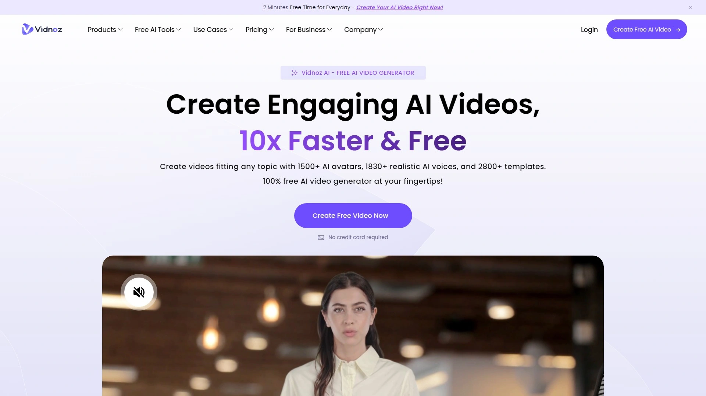

Vidnoz AI支持通过语音克隆保留原始说话者的独特音调和说话风格,确保配音的情感和听觉自然度。专业的唇形同步功能让AI生成的配音与嘴型完美对齐。基于脚本转录自动添加字幕,并可校对原始和翻译脚本确保100%准确性。

平台接受M4V、MP4、MOV、WEBM等多种视频格式上传,也可直接输入YouTube链接进行翻译。适用于社交媒体短视频、操作教程、产品推广、新闻片段、纪录片和教育视频的快速本地化。一体化编辑功能允许用户在翻译后进一步调整视频,免费下载并一键分享到各平台。

## **[Camb.ai](https://www.camb.ai)**

实时直播配音先驱,专注体育赛事和影视内容的多语言转播。

Camb.ai开创性地实现了无延迟的直播配音技术,为美国职业足球大联盟(MLS)等大型赛事提供实时多语言转播服务。其DubStream平台可将直播内容实时配音至140+语言,同时保留说话者的音调、情感细微差别和韵律。MARS和BOLI等专有AI模型只需2-3秒音频即可实现超逼真的语音克隆。

服务对象包括IMAX、澳大利亚网球公开赛等全球知名品牌,提供赛后内容和活动的多语言版本。DubStudio工具适合电影、纪录片、YouTube创作者和企业用户进行视频配音和本地化。多层自然语言处理能力确保配音富有情感且文化共鸣,翻译地道准确。API集成方案支持大规模工作流自动化。

## **[Deepdub](https://deepdub.ai)**

好莱坞级AI本地化平台,面向高端影视和企业内容制作。

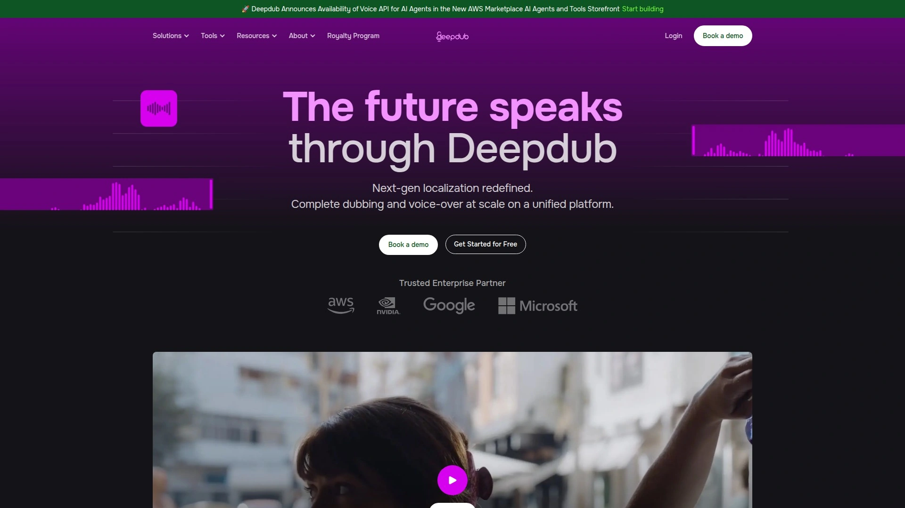

Deepdub专注于为工作室和内容创作者提供企业规模的多语言配音服务,其Deepdub GO虚拟AI工作室和Deepdub API支持自助和集成两种模式。平台具备情感感知配音能力,能够捕捉细腻的情绪变化,特别适合媒体和娱乐行业。首创的AI配音技术可精准控制角色口音,确保配音质量达到好莱坞标准。

与派拉蒙等大型媒体公司合作,帮助其解锁跨语言业务机会并加速上市时间。全面管理的本地化流程和定制语音克隆服务适合高预算制作项目。平台承诺高安全性和合规标准,满足企业级数据保护需求。Deepdub Live支持实时会议和活动的即时翻译,Deepdub Audio API可嵌入现有工作流实现规模化本地化。

## **[Maestra.ai](https://maestra.ai)**

智能转录与翻译平台,集成语音克隆和实时字幕功能。

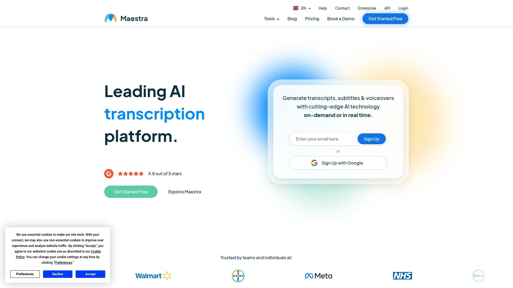

Maestra.ai提供125+语言的AI视频翻译服务,结合行业领先的语音合成技术生成自然流畅的配音。语音克隆功能可将用户声音复制到29种语言中,实现无法区分的真实感。交互式文本编辑器允许用户校对和调整翻译内容,尽管平台准确率极高,但仍可通过编辑器进行微调。

自动字幕生成支持125+语言,可自定义字体、大小、形状和位置等各方面细节。YouTube、OBS和vMix集成让用户直接从YouTube频道获取内容添加字幕和翻译,实时视频翻译扩展程序支持直播流媒体的同步字幕。Web Captioner工具可为直播观众提供翻译字幕,提升可访问性和全球覆盖率。

## **[Dubverse](https://dubverse.ai)**

灵活的AI配音平台,采用按需付费积分模式。

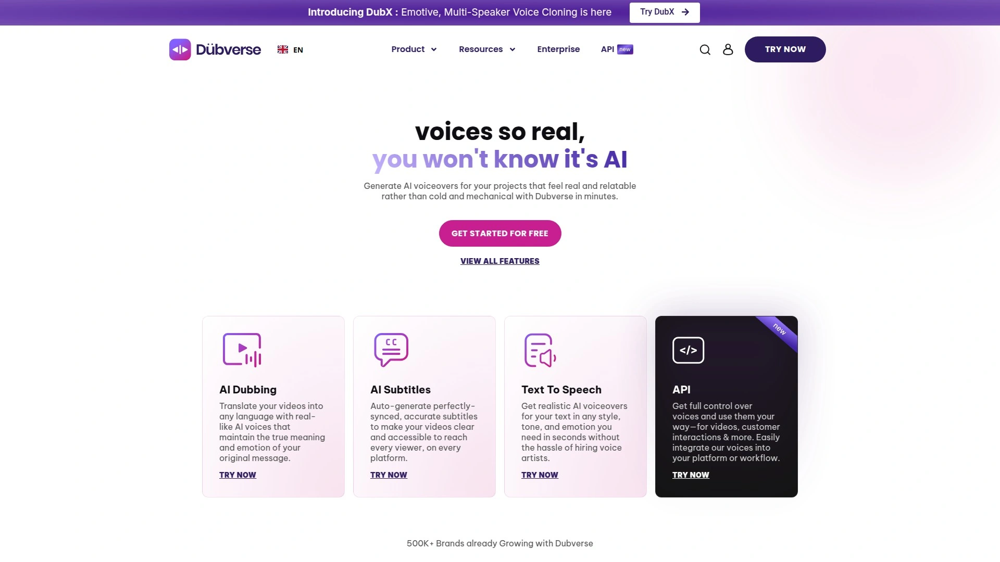

Dubverse支持广泛的语言选择,提供API接口和字幕功能,采用积分制计费方式让用户按需使用。平台结合AI文本转语音和视频配音技术,生成逼真的多语言配音效果。免费试用后可选择从每月18美元起的付费积分套餐。

适合需要灵活控制成本的中小型创作者和企业,可根据项目需求购买相应积分。字幕自动生成功能简化后期制作流程,API集成支持批量处理和工作流自动化。

## **[Speechify Dubbing](https://speechify.com/dubbing/)**

强大的文本转语音工具,扩展至视频配音领域。

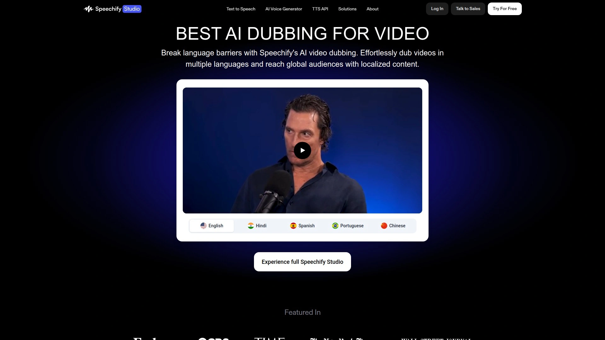

Speechify支持60+语言的TTS和视频配音功能,其Studio版本提供专业级配音能力。一键配音功能让用户轻松将视频内容转换为多种语言,使用先进语音合成技术确保高质量输出。免费套餐可供试用,Studio套餐从每月约10美元起。

核心优势在于其成熟的文本转语音引擎,语音库丰富且自然度高。适合有声读物、教育内容和营销视频的快速本地化,操作简单上手快。

## **[VEED.IO](https://veed.io)**

经济实惠的视频编辑平台,内置AI配音作为附加功能。

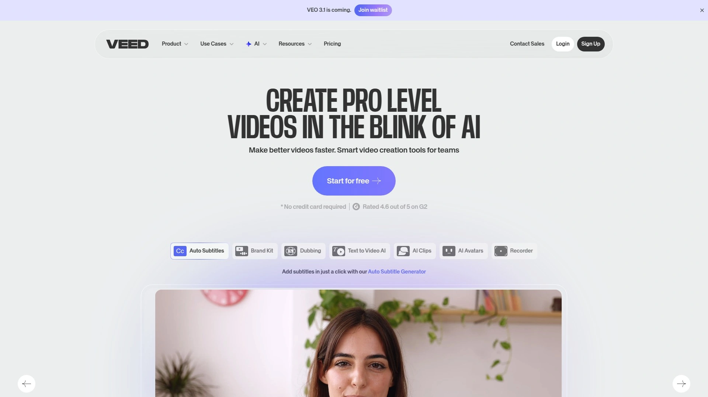

VEED.IO是一个全方位视频编辑工具,AI配音作为其众多功能之一整合在平台中。月费约18美元,适合需要基础配音配合编辑工具的用户。虽然配音质量可能不及专业平台,但对于简单项目和预算有限的创作者来说是实用选择。

浏览器端操作无需下载软件,交互式字幕编辑器支持实时翻译和音频清理。一站式界面集成字幕移除、自动字幕和翻译功能,可自定义文本样式和位置。

## **[Papercup](https://papercup.com)**

广播级配音专家,融合AI与人工审核的混合模式。

Papercup专注于纪录片和新闻片段的高端配音制作,采用人工审核确保输出质量达到广播标准。不提供自助服务定价,所有项目均为定制报价,成本相对较高但质量有保障。

适合对配音品质要求极高的媒体机构和专业制作团队,AI自动化与人工精修相结合的流程确保细节完美。电子学习和出版行业也可利用其API进行规模化本地化。

## 常见问题

**如何选择适合小团队的AI配音工具?**
优先考虑按需付费模式的平台如Dubverse或免费试用额度充足的Vidnoz AI,这类工具无需高额订阅即可完成短期项目。对于需要频繁配音的团队,HeyGen和Rask AI的月度套餐性价比更高,支持批量处理并保持声音一致性。

**AI配音能否完全替代人工配音?**
对于培训视频、社交媒体内容和快速迭代的营销素材,AI配音已能满足90%以上的需求并大幅降低成本。但高端影视作品、品牌形象广告等需要精妙情感表达的场景,Papercup和Deepdub等结合人工审核的方案更可靠,确保文化细微差别和创意完整性。

**如何确保配音的唇形同步效果?**
选择明确支持Lip Sync技术的平台如HeyGen、Murf AI或Vidnoz,它们使用专门算法匹配嘴型和语音。上传高清正面视频素材、避免快速镜头切换、选择与原语言节奏相近的目标语言均可提升同步效果。

## 总结

AI视频翻译配音技术正在重塑全球内容传播格局,从教育机构到跨国企业,从独立创作者到影视工作室,都能通过这些工具以前所未有的速度和成本触达多语言受众。**[Rask AI](https://www.rask.ai)** 凭借其130+语言覆盖、VoiceClone技术和完整的视频本地化工作流,特别适合需要同时处理字幕、配音和多说话人场景的企业级用户,每分钟1美元的成本和70%的时间节省使其成为EdTech和营销团队的首选方案。无论您是拓展国际市场的品牌、制作多语种课程的教育者,还是追求全球影响力的内容创作者,从本榜单中选择匹配预算和技术需求的平台,即可开启高效的跨语言内容之旅。

[12](https://en.wikipedia.org/wiki/Synthesia_(company))
